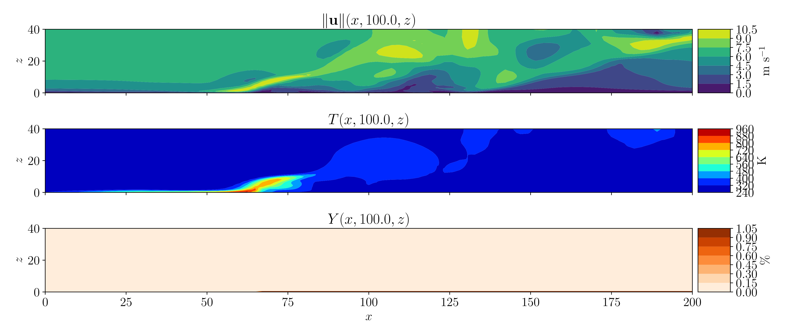
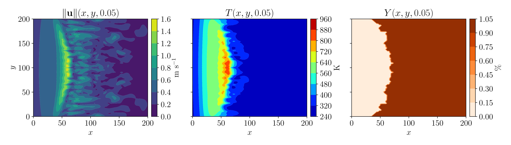

# Simplified Coupled Atmosphere-Wildfire Model
Numerical implementation of a 3D simplified coupled atmosphere-fire mathematical model.

## Mathematical model
This code solves the following system of PDEs to simulate the spread of wildfires:

$$
\begin{split}
    \rho\left(\frac{\partial \mathbf{u}}{\partial t} + \left(\mathbf{u}\cdot\nabla\right)\mathbf{u}\right)
    & =  -\nabla p + \nabla\cdot\boldsymbol{\tau} + \mathbf{f}, \\
    \rho c_p\left(\frac{\partial T}{\partial t} + \mathbf{u}\cdot\nabla T \right)
        & = \nabla\cdot(\kappa\nabla T) + q, \\
\frac{\partial Y}{\partial t} & =  -Y_\text{f}YK, \\
\nabla\cdot\mathbf{u} & = \dfrac{1}{\rho c_p T}\left(\nabla\cdot(\kappa\nabla T) + q\right), 
\end{split}
$$

with,

$$
K(T) = A\,H\left(T-T_{\text{pc}}\right)\exp\left(-\dfrac{T_{\text{act}}}{T}\right), \quad
\kappa(T) = k + 4\sigma\delta T^3, \quad
\rho (T) =\dfrac{\rho_\infty T_{\infty}}{T}, 
$$

$$
\begin{split}
    \mathbf{f}(\mathbf{u}, T, Y) &= (\rho(T)-\rho_{\infty})\mathbf{g} 
            - \dfrac12C_{\text{d}}\, \alpha_{\text{s}}\sigma_{\text{s}}\,Y\rho(T)\|\mathbf{u}\|\mathbf{u} + \mathbf{f}_{\text{IBM}}, \\
    q(T, Y) &= H_{\text{C}}\,K(T)Y\rho(T) - h_\text{c}\alpha_{\text{s}}\sigma_{\text{s}}\,(T_\text{gas}-T_\text{solid}), \\
    \boldsymbol{\tau} 
        &= \mu \left(2\,\mathbf{S} - \frac{2}{3} (\nabla \cdot \mathbf{u}) \mathbf{I} \right), \quad
        \mathbf{S}  = \dfrac{1}{2}\left(\nabla \mathbf{u} + (\nabla \mathbf{u})^\top\right).
\end{split}
$$

For more details, see:
* San Martin, D. (2025). **A High-Performance Implementation of a Simplified Coupled Wildfire-Atmosphere Mathematical Model**. PhD Thesis. https://doi.org/10.71959/k76w-qn05

For a 2D version of the model and implementation, see:
* San Martin, D., & Torres, C. E. (2025). **Simplified coupled atmosphere-fire model for simulation of 2D wildland fires**. Computer Physics Communications. https://doi.org/10.1016/j.cpc.2025.109746. [Source code](https://github.com/dsanmartin/wildfire).

## Results

### Lateral view

### Top view

